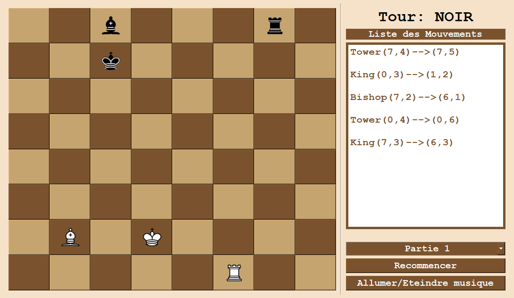

# Chess Game in C++

This is a C++ chess game project built with Qt for the graphical interface. The game includes a fully functional chessboard, player-controlled piece movements, and game state management. The project allows two players to play chess with classic rules and displays movement history, current player turns, and special indicators like check. The game also includes background music.

---

## Table of Contents
- [Overview](#overview)
- [Gameplay](#gameplay)
- [Controls](#controls)
- [Features](#features)
- [User Interface](#user-interface)
- [Installation](#installation)
- [Acknowledgments](#acknowledgments)

---

### Overview
This chess game is implemented using C++ and Qt for a graphical user interface. It includes:
- A standard 8x8 chessboard layout.
- All chess pieces implemented with full movement logic.
- A player turn system.
- Background music that can be toggled on or off.
- Multiple predefined game setups for testing.

### Gameplay
The game follows traditional chess rules. Players take turns moving their pieces, aiming to capture the opponent's king or place it in checkmate. Pieces include kings, queens, bishops, knights, rooks, and pawns, each with standard chess movements.

*The chessboard layout showing the current turn and list of moves.*

> **Note**: Some special moves (like castling and en passant) may not be fully implemented depending on project requirements.

### Controls
- **Click on a piece**: Selects the piece to move.
- **Click on a target square**: Moves the selected piece if the move is valid.
- **Restart Button**: Resets the game to its initial state.
- **Music Toggle Button**: Toggles the background music on or off.

### Features
- **Piece Movements**: Implemented according to standard chess rules.
- **Move History**: Displays a list of all moves in the game.
- **Turn Indicator**: Shows which player's turn it is (White or Black).
- **Check Indicator**: Highlights the king in red if it is in check.

*An example of the game with the king in check, highlighted in red.*

- **Multiple Game Modes**: Select from different predefined game setups using the dropdown menu.
- **Background Music**: Plays continuously and can be toggled with a button.

### User Interface
The game window includes:
- A chessboard with 8x8 grid cells.
- Movement history panel displaying all moves.
- Turn indicator to show whether it’s White’s or Black’s turn.

*Another state of the game showing available moves highlighted.*

---

### Installation
1. Clone this repository.
2. Open the project in Qt Creator or your preferred C++ IDE.
3. Ensure you have the required Qt libraries installed.
4. Build and run the project.

**Dependencies**:
- Qt framework for GUI and multimedia (Qt Multimedia module for music).

### Acknowledgments
- **Developers**: akramway00
- **Music**: Background music added to enhance the user experience.

Enjoy the game!
